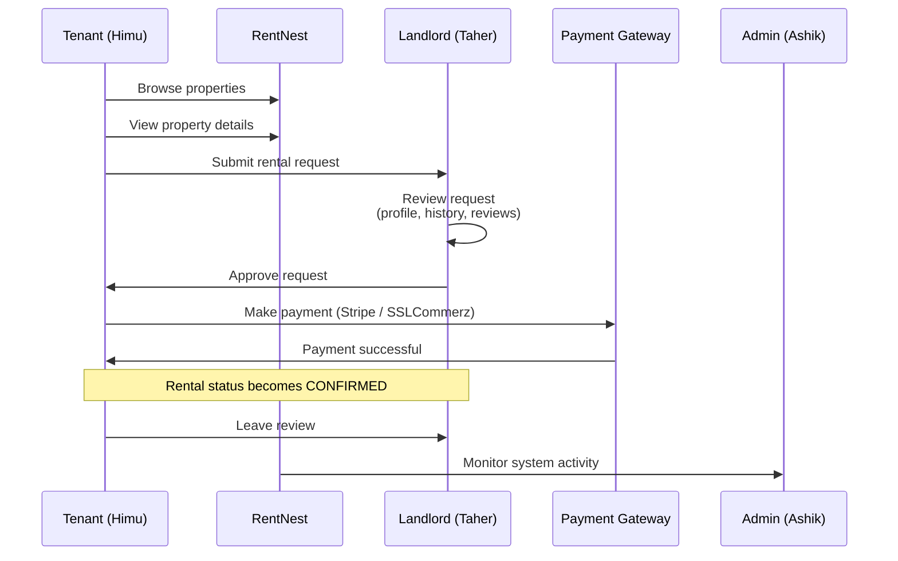
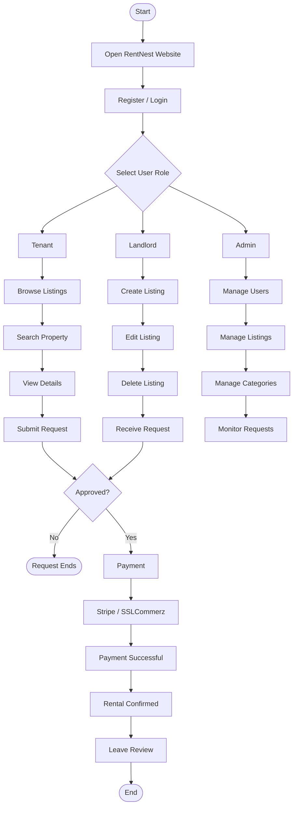
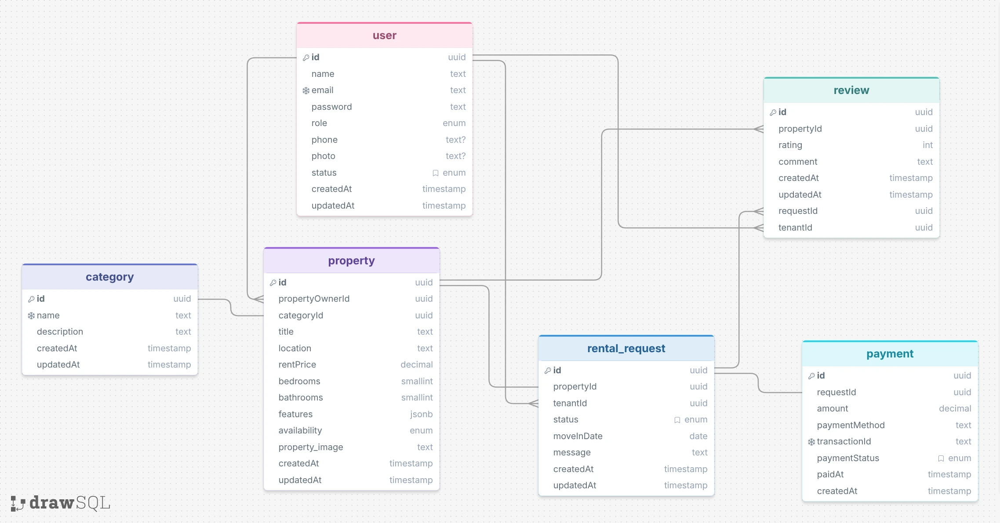
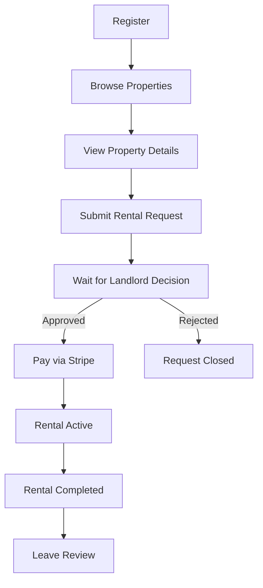
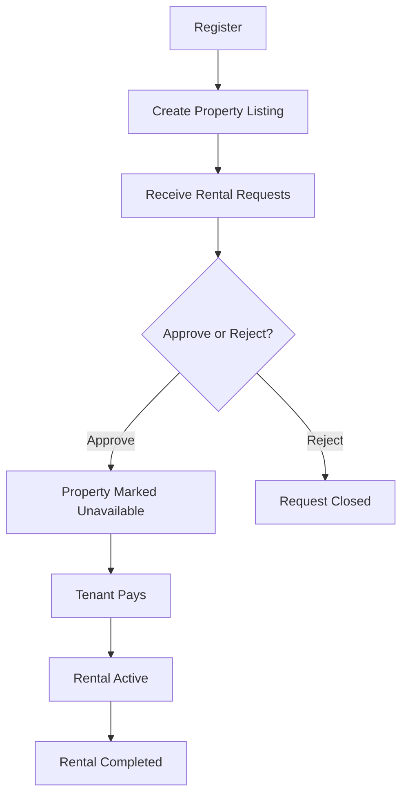
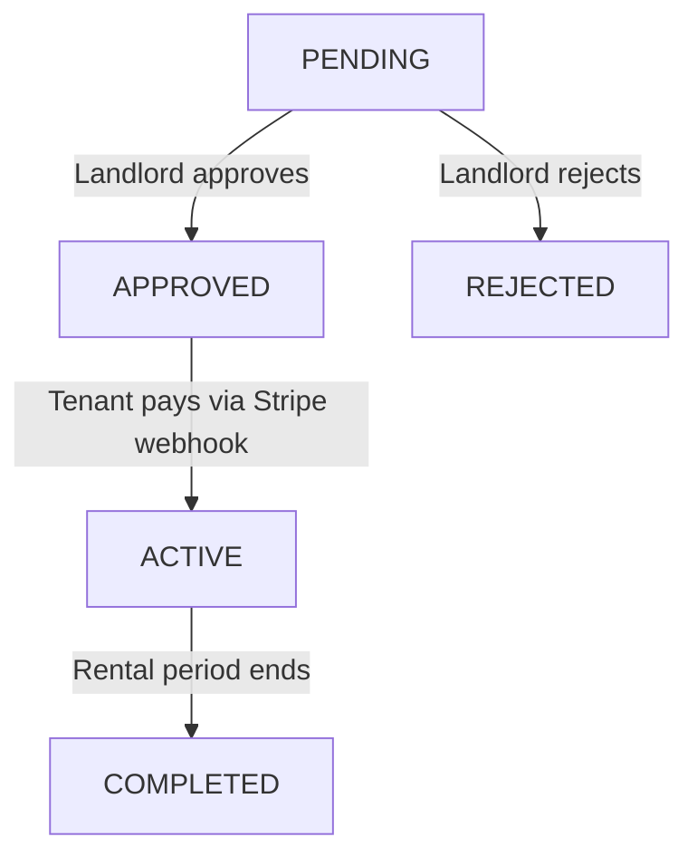

<a id="top"></a>
# RentNest — API Design & Documentation

A backend API for a rental property marketplace. Landlords list properties, tenants browse and request to rent them, payments are processed through Stripe, and admins moderate the platform.

## Table of Contents

- [1. Project Overview](#1-project-overview)
- [2. Roles & Permissions](#2-roles--permissions)
- [3. Technology Stack](#3-technology-stack)
- [4. Package Manager & Scripts](#4-package-manager--scripts)
- [5. Features](#5-features)
- [6. Standard Response Format](#6-standard-response-format)
- [7. API Endpoints](#7-api-endpoints)
  - [7.1 Authentication](#71-authentication)
  - [7.2 User Profile](#72-user-profile)
  - [7.3 Properties (Public)](#73-properties-public)
  - [7.4 Categories](#74-categories)
  - [7.5 Landlord Management](#75-landlord-management)
  - [7.6 Rental Requests](#76-rental-requests)
  - [7.7 Payments (Stripe)](#77-payments-stripe)
  - [7.8 Reviews](#78-reviews)
  - [7.9 Admin](#79-admin)
- [8. Database Tables](#8-database-tables)
- [9. Flow Diagrams](#9-flow-diagrams)

---

## 1. Project Overview

**RentNest** is a rental property marketplace where landlords list rental properties, tenants browse and request to rent them, and administrators manage the entire platform.

The platform covers the full rental lifecycle: a tenant searches for a property, submits a rental request, the landlord approves or rejects it, the tenant pays online through Stripe, and — once the rental period is complete — the tenant can leave a review. Admins oversee users, listings, and platform activity throughout.

[⬆ Back to top](#top)

---

## 2. Roles & Permissions

Every user selects a role (**TENANT** or **LANDLORD**) at registration. **ADMIN** accounts are not self-registrable — they're provisioned directly.

| Role | Description | Key Permissions |
|------|-------------|------------------|
| **Tenant** | Users looking for a place to rent | Browse and search properties · submit rental requests · pay rent via Stripe · view payment history · leave reviews after a completed rental · manage own profile |
| **Landlord** | Property owners listing rentals | Create, update, and delete property listings · set availability · approve or reject rental requests on their own properties · view their own properties and their tenant history |
| **Admin** | Platform moderators | View and manage all users (ban/unban, delete) · view all properties and rental requests · manage property categories · view platform-wide dashboard metrics |

[⬆ Back to top](#top)

---

## 3. Technology Stack

| Area | Technology | Notes |
|------|------------|-------|
| Runtime | Node.js | Development runs directly on TypeScript via `tsx`; production runs the bundled JavaScript output. |
| Language | TypeScript | Strict compiler settings enabled (`strict: true`). |
| Web framework | Express 5 | All routes are mounted on one Express application (`src/app.ts`). |
| ORM | Prisma 7 (`@prisma/adapter-pg`) | A single Prisma Client instance, backed by a `pg` connection pool, shared across modules. |
| Database | PostgreSQL (Prisma Postgres) | Connected through the `DATABASE_URL` environment variable. |
| Authentication | JWT + bcryptjs | Access and refresh tokens issued after password verification; delivered as httpOnly cookies. |
| Payments | Stripe | Rent payments are collected through Stripe Checkout; confirmed via a Stripe webhook. *(SSLCommerz is referenced in the original project brief as a second payment provider but is not yet implemented.)* |
| Middleware | cors, cookie-parser, body parsers | Standard Express request handling. *(A security-headers middleware such as `helmet` and request rate-limiting are recommended additions — see the code review notes.)* |
| Deployment | Vercel (serverless) | Entry point at `api/index.ts`, routed via `vercel.json`. |

[⬆ Back to top](#top)

---

## 4. Package Manager & Scripts

This project uses **npm**.

| Command | Purpose |
|---------|---------|
| `npm install` | Install all dependencies. `postinstall` automatically runs `prisma generate`. |
| `npm run dev` | Start the development server with live reload (`tsx watch src/server.ts`). |
| `npm run build` | Bundle the project for production (`tsup`). |
| `npm start` | Run the compiled server (`node dist/server.js`). |
| `npm run typecheck` | Run the TypeScript compiler in check-only mode, no output emitted. |

[⬆ Back to top](#top)

---

## 5. Features

### Public Features
- Browse all available rental properties, unauthenticated
- Search and filter by location, price range, and category
- Sort results by price or newest listing
- View full details of a single property

### Tenant Features
- Register and log in
- Submit rental requests for available properties
- Pay approved rentals online via Stripe
- View payment history and individual payment details
- View the status of their own rental requests (pending, approved, rejected, active, completed)
- Leave a review after a completed rental
- Manage their own profile

### Landlord Features
- Register and log in
- Create, update, and delete their own property listings
- Set a property's availability
- Approve or reject rental requests submitted for their properties
- View which of their properties have been requested and by whom

### Admin Features
- View all registered users
- Ban or unban a user
- Delete a user account
- View platform-wide dashboard metrics (user counts, property counts, request counts, payment counts)
- Manage property categories

[⬆ Back to top](#top)

---

## 6. Standard Response Format

Every endpoint in this API returns the same JSON envelope, whether the request succeeded or failed.

**Success:**
```json
{
  "success": true,
  "StatusCodes": 200,
  "message": "Human-readable description of what happened",
  "data": { },
  "Meta": null
}
```

`Meta` is only populated on paginated list endpoints (currently `GET /api/properties`), in the shape `{ "page": 1, "limit": 10, "total": 42 }`. Everywhere else it's `null`.

**Error:**
```json
{
  "success": false,
  "StatusCodes": 400,
  "name": "AppError",
  "message": "Human-readable description of what went wrong",
  "error": "stack trace / error detail"
}
```

[⬆ Back to top](#top)

---

## 7. API Endpoints

All endpoints are prefixed with the base URL of the deployed server (e.g. `http://localhost:5000` locally). Authentication is cookie-based: logging in sets an httpOnly `accessToken` cookie that is sent automatically on subsequent requests from the same client — there is no `Authorization: Bearer` header to manage manually.

### 7.1 Authentication

| Method | Route | Access | Behavior |
|--------|-------|--------|----------|
| POST | `/api/users/register` | Public | Registers a new user as TENANT or LANDLORD. |
| POST | `/api/auth/login` | Public | Verifies email and password, sets `accessToken`/`refreshToken` cookies. |
| POST | `/api/auth/refresh-token` | Requires `refreshToken` cookie | Issues a new access token once the current one expires. |

**Example request — Register:**
```json
{
  "name": "Himu Rahman",
  "email": "himu@example.com",
  "password": "SecurePass123",
  "role": "TENANT",
  "phone": "0168364407"
}
```

**Example response:**
```json
{
  "success": true,
  "StatusCodes": 201,
  "message": "User registered successfully.",
  "data": {
    "id": "01KX3PZTENANT000000000001",
    "name": "Himu Rahman",
    "email": "himu@example.com",
    "role": "TENANT",
    "phone": "0168364407",
    "activeStatus": "ACTIVE"
  },
  "Meta": null
}
```

[⬆ Back to top](#top)

---

### 7.2 User Profile

| Method | Route | Access | Behavior |
|--------|-------|--------|----------|
| GET | `/api/users/me` | Authenticated (any role) | Returns the currently authenticated user's profile. |
| PUT | `/api/users/updateProfile` | Authenticated (any role) | Updates the caller's own name, email, phone, or password. Only send the fields you want changed. |

**Example request — Update profile:**
```json
{
  "phone": "0168364499"
}
```

**Example response:**
```json
{
  "success": true,
  "StatusCodes": 200,
  "message": "Profile updated successfully.",
  "data": {
    "id": "01KX3PZTENANT000000000001",
    "name": "Himu Rahman",
    "email": "himu@example.com",
    "role": "TENANT",
    "phone": "0168364499"
  },
  "Meta": null
}
```

[⬆ Back to top](#top)

---

### 7.3 Properties (Public)

| Method | Route | Access | Behavior |
|--------|-------|--------|----------|
| GET | `/api/properties` | Public | Browse all properties. Supports `location`, `minPrice`, `maxPrice`, `category`, `sort` (`price_asc`/`price_desc`), `page`, and `limit` (capped at 100) query params. |
| GET | `/api/properties/:propertyId` | Public | Full details of a single property, including category and owner contact info. |

**Example request:**
```
GET /api/properties?location=Kuala Lumpur&minPrice=500&maxPrice=2000&sort=price_asc&page=1&limit=10
```

**Example response:**
```json
{
  "success": true,
  "StatusCodes": 200,
  "message": "Properties retrieved successfully.",
  "data": [
    {
      "id": "01KX3NW25QGD2M2FEQ702B0A91",
      "title": "Bukit Bintang Modern Apartment",
      "location": "Kuala Lumpur, MY",
      "rentPrice": 1800,
      "bedRooms": 2,
      "bathRooms": 1,
      "availability": "AVAILABLE",
      "category": { "name": "Apartment" },
      "propertyOwner": { "name": "Taher Ahmed", "email": "taher@example.com", "phone": "0169998888" }
    }
  ],
  "Meta": { "page": 1, "limit": 10, "total": 1 }
}
```

[⬆ Back to top](#top)

---

### 7.4 Categories

| Method | Route | Access | Behavior |
|--------|-------|--------|----------|
| GET | `/api/categories` | ADMIN* | List all property categories. |
| POST | `/api/categories` | None* | Create a new category. |
| PUT | `/api/categories/:id` | ADMIN | Update a category's name or description. |
| DELETE | `/api/categories/:id` | ADMIN | Delete a category. Fails if properties still reference it. |

*⚠️ **Known gap:** category browsing should be public (so the property filter UI can populate its dropdown without a login) and category creation should be ADMIN-only. The current implementation has this reversed. Documented here as-is; see the project's code review notes for the fix.

**Example request — Create category:**
```json
{
  "name": "Studio",
  "description": "Compact residential units combining living, sleeping, and kitchen areas in one open space."
}
```

**Example response:**
```json
{
  "success": true,
  "StatusCodes": 201,
  "message": "Category created successfully.",
  "data": {
    "id": "36d3fa42-7481-4244-9506-ea5d185bf865",
    "name": "Studio",
    "description": "Compact residential units combining living, sleeping, and kitchen areas in one open space."
  },
  "Meta": null
}
```

[⬆ Back to top](#top)

---

### 7.5 Landlord Management

| Method | Route | Access | Behavior |
|--------|-------|--------|----------|
| POST | `/api/properties/landlord` | LANDLORD, ADMIN | Create a new property listing. |
| PUT | `/api/properties/landlord/:id` | LANDLORD (own property), ADMIN | Update a listing. Ownership cannot be reassigned through this endpoint. |
| DELETE | `/api/properties/landlord/:id` | LANDLORD (own property), ADMIN | Remove a listing. |
| GET | `/api/properties/my-properties` | LANDLORD | List every property the logged-in landlord owns. |

**Example request — Create listing:**
```json
{
  "title": "Ipoh Private Rental Room",
  "location": "Ipoh, MY",
  "categoryId": "36d3fa42-7481-4244-9506-ea5d185bf865",
  "rentPrice": 450,
  "bedRooms": 1,
  "bathRooms": 1,
  "fetures": ["wifi", "fan", "shared-kitchen"],
  "availability": "AVAILABLE",
  "property_image": ["https://example.com/ipoh-room1.png"]
}
```

**Example response:**
```json
{
  "success": true,
  "StatusCodes": 201,
  "message": "Property created successfully.",
  "data": {
    "id": "01KX3KS114C3HSW72BNPRXEWSM",
    "title": "Ipoh Private Rental Room",
    "location": "Ipoh, MY",
    "rentPrice": 450,
    "availability": "AVAILABLE"
  },
  "Meta": null
}
```

[⬆ Back to top](#top)

---

### 7.6 Rental Requests

| Method | Route | Access | Behavior |
|--------|-------|--------|----------|
| POST | `/api/rentals` | TENANT | Submit a rental request for a property. Always starts at status `PENDING`. |
| GET | `/api/rentals` | TENANT, LANDLORD, ADMIN | List rental requests, scoped to what the caller is allowed to see. |
| GET | `/api/rentals/:requestId` | TENANT (own), LANDLORD (own property), ADMIN | Full details of one rental request. |
| PUT | `/api/rentals/:id/status` | LANDLORD (own property), ADMIN | Approve, reject, or progress a request's status. |

Allowed status transitions: `PENDING → APPROVED / REJECTED`, `APPROVED → ACTIVE`, `ACTIVE → COMPLETED`. Admins may override this and set a status directly (e.g. to confirm a manually-verified cash payment).

**Example request — Submit request:**
```json
{
  "propertyId": "01KX3NW25QGD2M2FEQ702B0A91",
  "message": "I am very interested in this property and would like to move in by the requested date.",
  "moveInDate": "2027-09-01T00:00:00.000Z"
}
```

**Example response:**
```json
{
  "success": true,
  "StatusCodes": 201,
  "message": "Rental request submitted successfully.",
  "data": {
    "id": "189f938c-9178-45fb-994f-492eb826504b",
    "propertyId": "01KX3NW25QGD2M2FEQ702B0A91",
    "tenantId": "01KX3PZTENANT000000000001",
    "status": "PENDING",
    "moveInDate": "2027-09-01T00:00:00.000Z"
  },
  "Meta": null
}
```

[⬆ Back to top](#top)

---

### 7.7 Payments (Stripe)

| Method | Route | Access | Behavior |
|--------|-------|--------|----------|
| POST | `/api/pay/create-checkout-session` | TENANT | Creates a Stripe Checkout session for an approved rental request the caller submitted. |
| GET | `/api/pay` | TENANT | Lists the caller's own payment history. |
| GET | `/api/pay/:id` | TENANT (own), LANDLORD, ADMIN | Details of a single payment. |

Payments are confirmed asynchronously through a Stripe webhook (`POST /api/subscription/webhook`), which marks the payment `PAID` and the associated rental request `ACTIVE`. This webhook is called by Stripe directly and is not part of the client-facing API surface.

**Example request — Create checkout session:**
```json
{
  "requestId": "7e4af5d7-86c1-415c-85be-40325d8d227c"
}
```

**Example response:**
```json
{
  "success": true,
  "StatusCodes": 200,
  "message": "Checkout session created successfully.",
  "data": {
    "checkoutUrl": "https://checkout.stripe.com/c/pay/cs_test_example"
  },
  "Meta": null
}
```

[⬆ Back to top](#top)

---

### 7.8 Reviews

| Method | Route | Access | Behavior |
|--------|-------|--------|----------|
| POST | `/api/review` | TENANT | Leave a review, tied to a specific completed rental request. |
| GET | `/api/review/:propertyId` | TENANT, LANDLORD, ADMIN | All reviews left for a property. |
| GET | `/api/review/tenant-reviews` | TENANT | Every review the caller has written. |

A review can only be created once its associated rental request has reached status `COMPLETED`, and `rating` must be between 1 and 5.

**Example request:**
```json
{
  "propertyId": "01KX3NW25QGD2M2FEQ702B0A91",
  "requestId": "7e4af5d7-86c1-415c-85be-40325d8d227c",
  "rating": 5,
  "comment": "The property was excellent, very clean and in a great location!"
}
```

**Example response:**
```json
{
  "success": true,
  "StatusCodes": 201,
  "message": "Review submitted successfully.",
  "data": {
    "id": "4b2e1a9d-6f3c-4e2a-8b1a-2d5e7f9c1a3b",
    "propertyId": "01KX3NW25QGD2M2FEQ702B0A91",
    "rating": 5,
    "comment": "The property was excellent, very clean and in a great location!"
  },
  "Meta": null
}
```

[⬆ Back to top](#top)

---

### 7.9 Admin

| Method | Route | Access | Behavior |
|--------|-------|--------|----------|
| GET | `/api/admin/allusers` | ADMIN | List every user on the platform. |
| GET | `/api/admin/user/:id` | ADMIN | Full details of one user. |
| PATCH | `/api/admin/user/:id/status` | ADMIN | Ban or unban a user (`activeStatus`: `ACTIVE` / `BANNED`). |
| DELETE | `/api/admin/user/:id` | ADMIN | Delete a user. Fails if the user still owns properties or has open rental requests. |
| GET | `/api/admin/dashboard` | ADMIN | Platform-wide summary counts. |

**Example request — Ban a user:**
```json
{
  "activeStatus": "BANNED"
}
```

**Example response:**
```json
{
  "success": true,
  "StatusCodes": 200,
  "message": "User status updated successfully.",
  "data": {
    "id": "01KX3PZTENANT000000000001",
    "name": "Himu Rahman",
    "activeStatus": "BANNED"
  },
  "Meta": null
}
```

[⬆ Back to top](#top)

---

## 8. Database Tables

- **Users** — Stores user information, authentication details, and role (`TENANT` / `LANDLORD` / `ADMIN`)
- **Properties** — Rental property listings, linked to a landlord and a category
- **Categories** — Property type categories (apartment, house, studio, etc.)
- **RentalRequests** — Rental requests between tenants and landlords, tracked through a status lifecycle
- **Payments** — Payment transactions (`transactionId`, `requestId`, `amount`, `paymentMethod`, `paymentStatus`, `paidAt`), one per rental request
- **Reviews** — Tenant reviews for properties, tied to a specific completed rental request

[⬆ Back to top](#top)

---

## 9. Flow Diagrams

<a id="sequence-diagram"></a>
## 📜 Sequence Diagram

This shows the same flow as a timeline of messages between the tenant, the platform, the landlord, the payment gateway, and the admin.



[⬆ Back to top](#top)

---

<a id="website-flowchart"></a>
## 🌐 Website Flowchart

This is the full site-level flow, showing what each role can do after logging in.



[⬆ Back to top](#top)

---

<a id="erd"></a>
## 🗄️ ERD (Entity Relationship Diagram)

[](https://drawsql.app/teams/kazi-ashikur/diagrams/rentnest#)

🔗 **Live diagram (drawSQL):** https://drawsql.app/teams/kazi-ashikur/diagrams/rentnest

### 🏠 Tenant Journey



### 🏘️ Landlord Journey



### 📊 Rental Request Status



[⬆ Back to top](#top)
